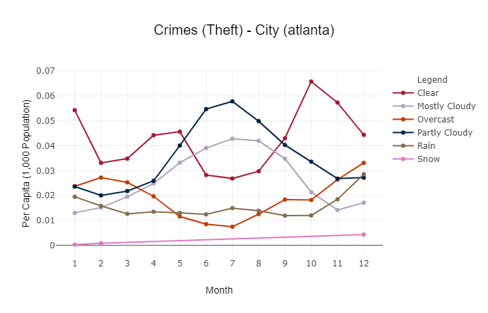

# Project_2 - Interactive Visualizations

Use: Python Flask–powered RESTful API, HTML/CSS, JavaScript, and Postgres database

## Data

Crime data was selcted from 5 cities (Atlanta, Boston, Chicago, Denver, and Los Angeles) for years 2014 - 2018. Weather and population data was selected to correspond to the crime data.

### Crime Data: (city, crime code, crime description, date-time, latitude, longitude)
    Atlanta: http://www.atlantapd.org/i-want-to/crime-data-downloads
    Boston: https://data.boston.gov/dataset/crime-incident-reports-august-2015-to-date-source-new-system
    Chicago, IL: https://www.kaggle.com/chicago/chicago-crimeAtlanta
    Denver: https://www.kaggle.com/paultimothymooney/denver-crime-data/downloads/denver-crime-data.zip/39
    Los Angeles: https://www.kaggle.com/cityofLA/los-angeles-crime-arrest-dataDenver

### Weather Data: (city, date, time, weather type)
    data: https://darksky.net/dev

### Population 
    data: https://www.opendatanetwork.com/entity/310M200US12060/Atlanta_Metro_Area_GA/demographics.population.count?year=2017

## Munging

Using Python, the yearly crime data was cleaned and combined. The following fields: city, crime code, date, time, latitude, and longitude. The combined data has over 900 crime codes. For analysis purposes, the crime codes were grouped to 24 categories using the crime descriptions. The weather data was combined using Python and the weather type was collapsed to 30 cataegories for the anlaysis. 

The cleaned crime and weather files were merged on city, date, and time (hour 0-23).

The data was further summarized for use in interactive plots by removing the latitude and longitude and collapsing the crimes to the following : Auto-Theft, Other, Property, Theft, Violation, and Violence and the weather to Clear, Mostly Cloudy, Overcast, Partly Cloudy, Rain, and Snow. Also, the 2104 and 2015 year was excluded for Boston and Chicago since these were inclomplete years. The population was added and the file was converted to a sqlite database.

## Line Plots

An interactive plots allowing the user to investigate the crime-weather-population data. 

The first plot shows the crime information by each city along the following indicators:
    Chart Type: Year, Month, DayofWeek, StartTime
    Crime Selector: Auto-Theft, Other, Property, Theft, Violation, Violence
    Weather Selector: Clear, Mostly Cloudy, Overcast, Partly Cloudy, Rain, Snow
    Measure Selector: Percentage, Per Capita, Count

    

The first plot shows the crime information by each weather group along the following indicators:
    Chart Type: Year, Month, DayofWeek, StartTime
    Crime Selector: Auto-Theft, Other, Property, Theft, Violation, Violence
    City Selector: Atlanta, Boston, Chicago, Denver, and Los Angeles
    Measure Selector: Percentage, Per Capita, Count

    

